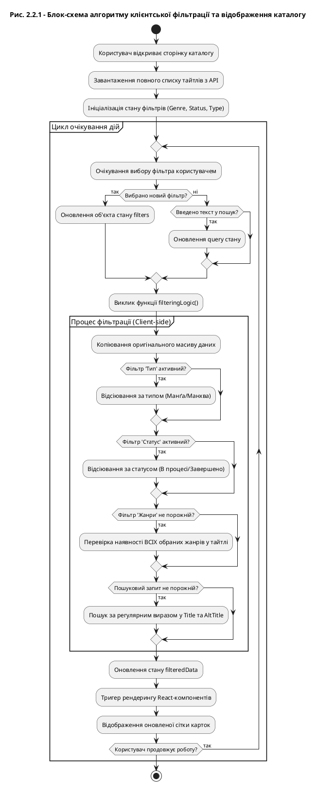

# Блок-схема алгоритму клієнтської фільтрації

Ось код для PlantUML (використовуйте на [PlantUML.com](https://www.plantuml.com/plantuml/)):

### Як цим користуватися:
1. Скопіюйте код між `@startuml` та `@enduml`.
2. Перейдіть на сайт [PlantUML Online Server](https://www.plantuml.com/plantuml/).
3. Вставте код у текстове поле.
4. Ви отримаєте професійну блок-схему для вашої документації.
