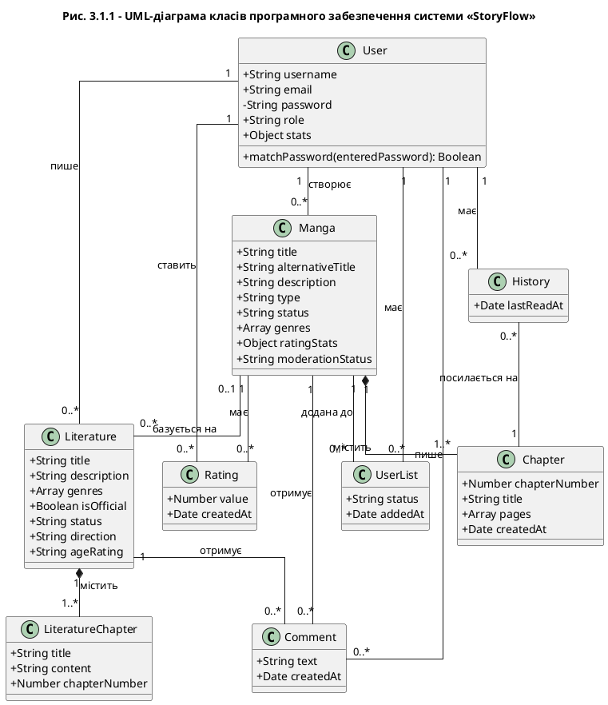

# UML-діаграма класів програмного забезпечення StoryFlow

Ось код для PlantUML (Діаграма класів):

### Пояснення діаграми:
1.  **Класи**: Кожен клас відповідає моделі в базі даних (User, Manga, Chapter тощо).
2.  **Атрибути**: Вказано типи даних (String, Number, Array, Date). Приватні поля (як-от пароль) позначені знаком `-`, публічні — `+`.
3.  **Методи**: Наприклад, у класу `User` є метод `matchPassword` для перевірки авторизації.
4.  **Зв'язки**:
    - **Композиція (`*--`)**: Тісний зв'язок між Manga та Chapter (розділ не може існувати без манги).
    - **Асоціація (`--`)**: Зв'язки між користувачем та його контентом або оцінками.
    - **Кратність (`1`, `0..*`)**: Показує, скільки об'єктів одного класу може бути пов'язано з іншим (наприклад, один користувач має багато коментарів).
