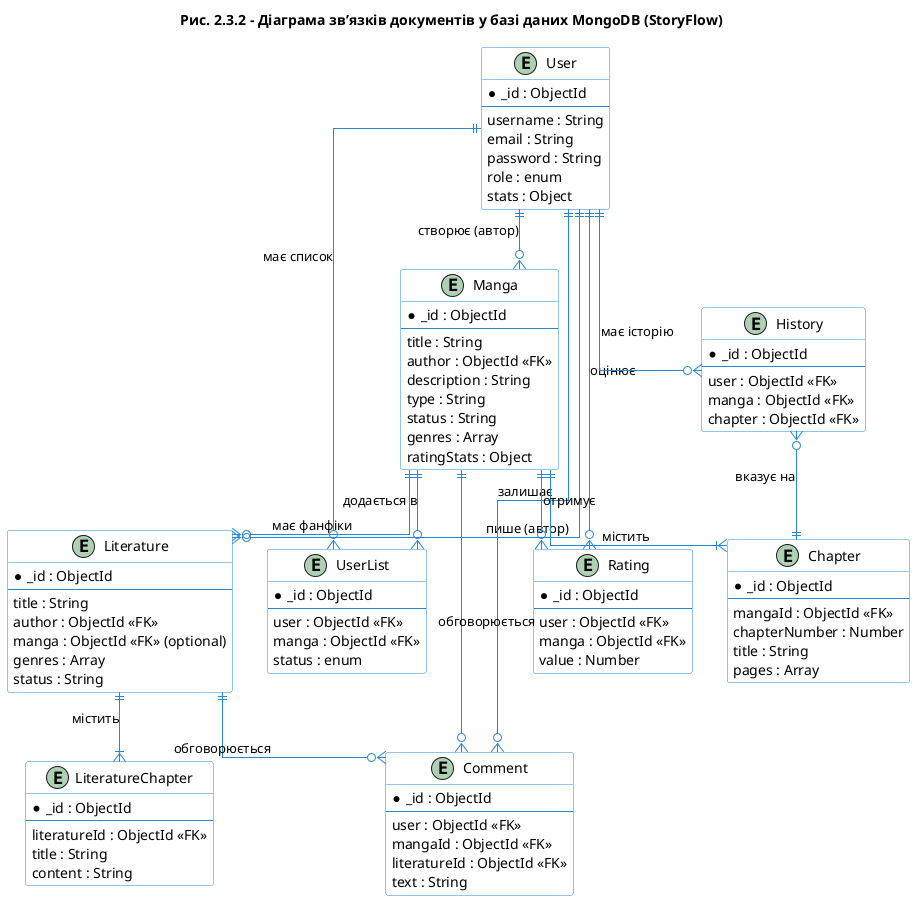

# Діаграма зв’язків документів у базі даних MongoDB

Ось код для PlantUML (ER-діаграма для NoSQL бази даних):

### Опис зв'язків:
1.  **User -> Manga/Literature**: Зв'язок "один-до-багатьох" (один користувач може бути автором багатьох творів).
2.  **Manga -> Chapter**: Зв'язок "один-до-багатьох" (один тайтл містить багато розділів).
3.  **Manga -> Literature**: Опціональний зв'язок, якщо фанфік або книга базується на конкретній манзі.
4.  **UserList / Rating**: Таблиці зв'язків (Many-to-Many), що з'єднують користувачів та контент.
5.  **History**: Фіксує прогрес читання конкретного користувача в конкретному розділі.
