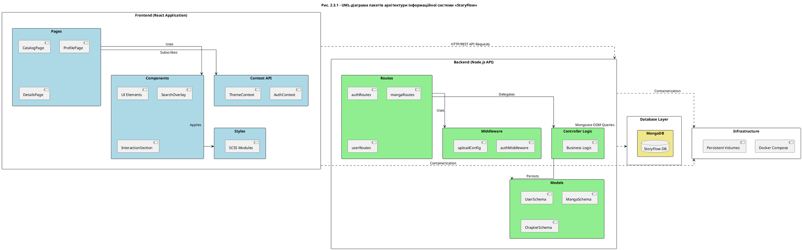

# UML-діаграма пакетів архітектури StoryFlow

Ось код для PlantUML, що описує структуру пакетів вашої системи:

### Що відображає ця діаграма:
1.  **Frontend**: Розбиття на компоненти, сторінки, контекст (стан) та стилі.
2.  **Backend**: Розподіл на маршрути (Routes), посередників (Middleware), моделі даних (Models) та бізнес-логіку.
3.  **Database**: Рівень збереження даних (MongoDB).
4.  **Infrastructure**: Docker-контейнеризація, яка об'єднує всі частини.
5.  **Зв'язки**: Показує, як дані течуть від користувача через API до бази даних.
