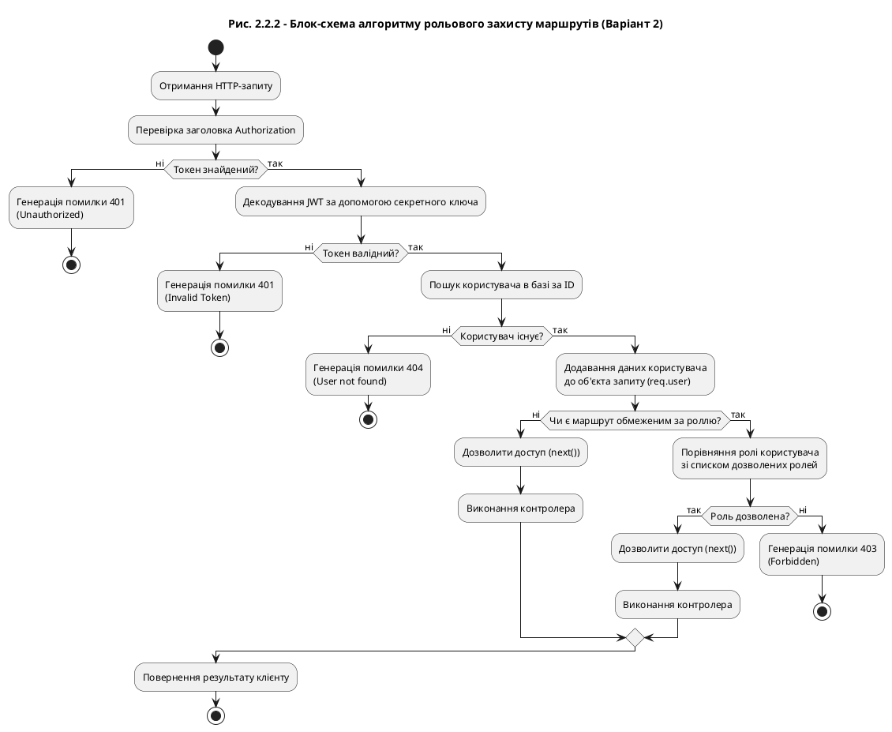

# Альтернативна блок-схема алгоритму рольового захисту

Ось інший варіант коду для PlantUML (більш класичний стиль блок-схеми):

### Особливості цієї схеми:
1. **Стиль**: Використано класичний чорно-білий стиль (monochrome), що часто краще виглядає в друкованих роботах.
2. **Логіка**: Чітко розділено етапи "Пошук токена -> Валідація -> Пошук користувача -> Перевірка прав".
3. **Обробка помилок**: Кожен негативний сценарій завершується окремим блоком `stop` з вказанням коду помилки.
